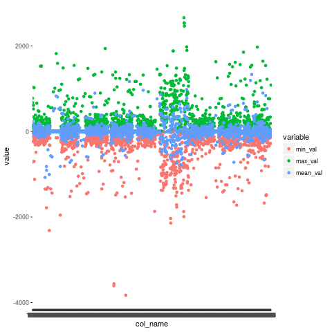
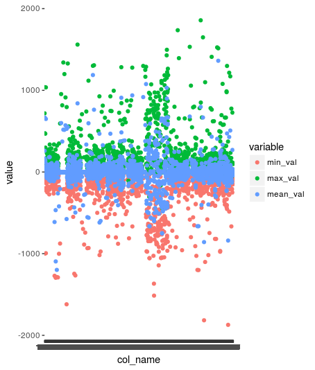

```{r setup, include=FALSE}
knitr::opts_chunk$set(echo = TRUE)
library(lubridate)
library(knitr)
library(randomcoloR)
library(rje)
library(reshape2)
library(ggplot2)
source(file = "/home/datascience/h2020gridforecast/R/hdf5_data_layer.R")
train_all <- readRDS(file = "../../../local_data/train_all.rds")
adapt_all <- readRDS(file = "../../../local_data/adapt_all.rds")
recalculate <- FALSE
```

Format/extension: h5.
The data sets contain 5 min flow-related measurements of high-tension power lines. All together, there are 1916 time series in both data sets. The geolocations of these measurements are not included. Measurements have a sign and it can be different within a time series. This indeed happens for 1141 power lines within just the adapt data set.

The data is a subset of all such lines. In upcoming competition stages, the time increments might vary and time series might have missing values (NaN).

Based on scale and distribution of the values, the measurements are most likely power (load) in MW.

## Train

```{r echo=FALSE}
if (recalculate) {
  column_summaries_train <- data.frame(
    col_name = colnames(train_all), 
    min_val = unlist(lapply(
      colnames(train_all), 
      function (x) min(train_all %>% pull(x), na.rm = TRUE)
    )), 
    max_val = unlist(lapply(
      colnames(train_all), 
      function (x) max(train_all %>% pull(x), na.rm = TRUE)
    )), 
    mean_val = unlist(lapply(
      colnames(train_all), 
      function (x) mean(train_all %>% pull(x), na.rm = TRUE)
    ))
  )
  
  column_summaries_train_long <- melt(column_summaries_train %>% arrange(mean_val), id = "col_name")
  ggplot(
    data = column_summaries_train_long %>% filter(col_name != "timestamp"), 
    aes(x = col_name, y = value, colour = variable)
  ) + geom_point()
  dev.copy(png, 'target_train_statistics.png')
  dev.off()
}
```
Following the minimal, average and maximal value for each power line:
image: 

Choose here a power line ID to see the respective historical measurements.

```{r echo=FALSE}
selectInput(
  inputId = "target_train_column", 
  label = "power line ID:", 
  choices=colnames(train_all %>% select(-timestamp)), 
  selectize = FALSE
)
train_all$datetime = as.POSIXct(train_all$timestamp, origin = "1970-01-01")
```

```{r echo=FALSE}
renderPlot({
  plot(
    sort(train_all$datetime), 
    train_all %>% 
      arrange(datetime) %>% 
      pull(input$target_train_column), 
    type = "l"
  )
  title(main = input$target_train_column)
})
```

## Adapt
Adapt data is delivered in files of 12 time steps each, i.e. 5 minute resolution of a whole hour.

```{r echo=FALSE}
if (recalculate) {
  column_summaries_adapt <- data.frame(
    col_name = colnames(adapt_all), 
    min_val = unlist(lapply(
      colnames(adapt_all), 
      function (x) min(adapt_all %>% pull(x), na.rm = TRUE)
    )), 
    max_val = unlist(lapply(
      colnames(adapt_all), 
      function (x) max(adapt_all %>% pull(x), na.rm = TRUE)
    )), 
    mean_val = unlist(lapply(
      colnames(adapt_all), 
      function (x) mean(adapt_all %>% pull(x), na.rm = TRUE)
    ))
  )
  
  column_summaries_adapt_long <- melt(column_summaries_adapt %>% arrange(mean_val), id = "col_name")
  ggplot(
    data = column_summaries_adapt_long %>% filter(col_name != "timestamp"), 
    aes(x = col_name, y = value, colour = variable)
  ) + geom_point()
  dev.copy(png, 'target_adapt_statistics.png')
  dev.off()
}
```
Following the minimal, average and maximal value for each power line:
image: 

Choose here a power line ID to see the respective historical measurements.

```{r echo=FALSE}
selectInput(
  inputId = "target_adapt_column", 
  label = "power line ID:", 
  choices=colnames(adapt_all %>% select(-timestamp)), 
  selectize = FALSE
)
adapt_all$datetime = as.POSIXct(adapt_all$timestamp, origin = "1970-01-01")
```

```{r echo=FALSE}
renderPlot({
  plot(
    sort(adapt_all$datetime), 
    adapt_all %>% 
      arrange(datetime) %>% 
      pull(input$target_adapt_column), 
    type = "l"
  )
  title(main = input$target_adapt_column)
})
```
